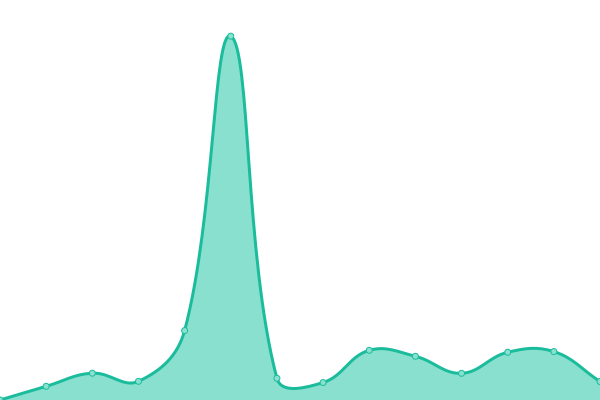
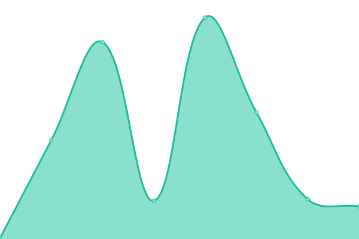
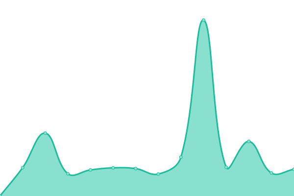

# [📈 Live Status](https://upptime.github.io/upptime): <!--live status--> **🟧 Partial outage**

This repository contains the open-source uptime monitor and status page for [Upptime](https://upptime.js.org), powered by [Upptime](https://github.com/upptime/upptime).

With [Upptime](https://upptime.js.org), you can get your own unlimited and free uptime monitor and status page, powered entirely by a GitHub repository. We use [Issues](https://github.com/upptime/upptime/issues) as incident reports, [Actions](https://github.com/azrielbsi/monitor/actions) as uptime monitors, and [Pages](https://upptime.github.io/upptime) for the status page.

<!--start: status pages-->
<!-- This summary is generated by Upptime (https://github.com/upptime/upptime) -->
<!-- Do not edit this manually, your changes will be overwritten -->
<!-- prettier-ignore -->
| URL | Status | History | Response Time | Uptime |
| --- | ------ | ------- | ------------- | ------ |
|  [Amelia Bot](https://ameliabot.dev/) | 🟥 Down | [amelia-bot.yml](https://github.com/azrielbsi/monitor/commits/HEAD/history/amelia-bot.yml) | 

 0ms
     
 | 

<a href="https://azrielbsi.github.io/monitor/history/amelia-bot">0.00%</a>
    

|  [Sakai Wolford Bot](https://sakaibot-discord.uzumekiulee.repl.co/) | 🟩 Up | [sakai-wolford-bot.yml](https://github.com/azrielbsi/monitor/commits/HEAD/history/sakai-wolford-bot.yml) | 

 6226ms
     
 | 

<a href="https://azrielbsi.github.io/monitor/history/sakai-wolford-bot">98.42%</a>
    

|  [Crypto Mining](https://julius-ulee.github.io/Crypto-Mining/) | 🟩 Up | [crypto-mining.yml](https://github.com/azrielbsi/monitor/commits/HEAD/history/crypto-mining.yml) | 

 90ms
     
 | 

<a href="https://azrielbsi.github.io/monitor/history/crypto-mining">100.00%</a>
    

|  [Mining](https://mining.uzumekiulee.repl.co) | 🟥 Down | [mining.yml](https://github.com/azrielbsi/monitor/commits/HEAD/history/mining.yml) | 

 2782ms
     
 | 

<a href="https://azrielbsi.github.io/monitor/history/mining">98.02%</a>
    

|  [Google](https://google.com) | 🟩 Up | [google.yml](https://github.com/azrielbsi/monitor/commits/HEAD/history/google.yml) | 

 234ms
     
 | 

<a href="https://azrielbsi.github.io/monitor/history/google">100.00%</a>
    

<!--end: status pages-->

[**Visit our status website →**](https://upptime.github.io/upptime)

## 📄 License

- Powered by: [Upptime](https://github.com/upptime/upptime)
- Code: [MIT](./LICENSE) © [Upptime](https://upptime.js.org)
- Data in the `./history` directory: [Open Database License](https://opendatacommons.org/licenses/odbl/1-0/)
